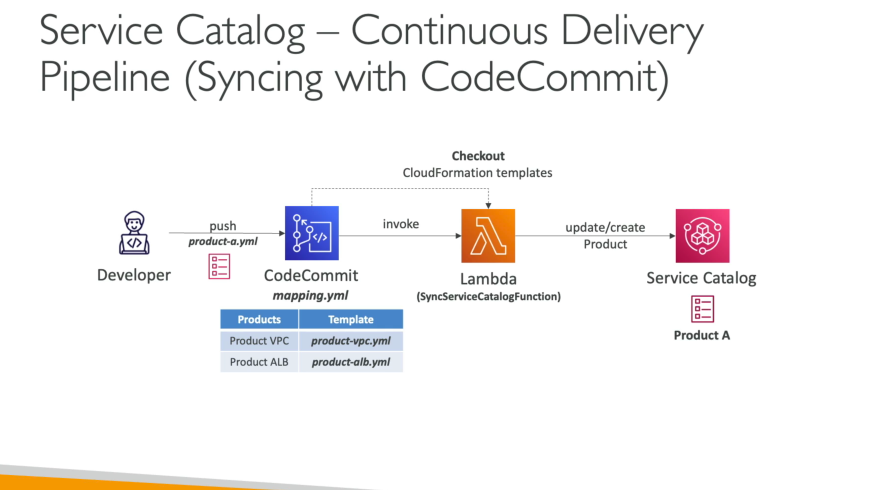

# AWS Service Catalog

- It is a self-service portal to launch a set of authorized AWS services of which configuration is predefined by admins
- Service Catalog is using CloudFormation under the hood
- Service Catalog tasks:
    - Admin tasks:
        - Create Product: these are CloudFormation templates
        - Create Portfolio: collection of products
        - Assign IAM roles to portfolios
    - Users tasks:
        - They presented with a product list
        - They will launch products
- Service Catalog is used to create and manage catalogs of IT services that are approved by administrators on AWS
- CloudFormation helps ensure consistency and standardization by admins
- Users (teams) are presented with a self-service portal where they can launch the products
- Service Catalog helps with governance, compliance and consistency
- Service Catalog integrates with "self-service portals" such as ServiceNow

## StackSet Constraints

- They allow us to configure Product deployment options
- We can restrict by:
    - Account: identify AWS accounts where we want to create Products
    - Region: identify regions where we want to deploy
    - Permissions: which IAM role should be used to deploy the StackSet

## Launch Constraints

- It is an IAM Role assigned to a Product which allows an user to launch, update or terminate products with minimal IAM permissions
- Example: end-user has access to Service Catalog, all other permissions required are attached to the Launch Constraint IAM Role
- The launch constraint IAM role must have the following permissions:
    - CloudFormation (Full Access)
    - Permission to AWS Services in the CloudFormation template
    - Read Access to S3 Bucket which contains the CloudFormation template

## Continuous Delivery Pipelines with Service Catalog

