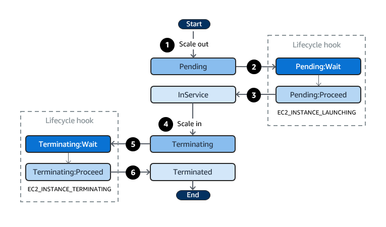
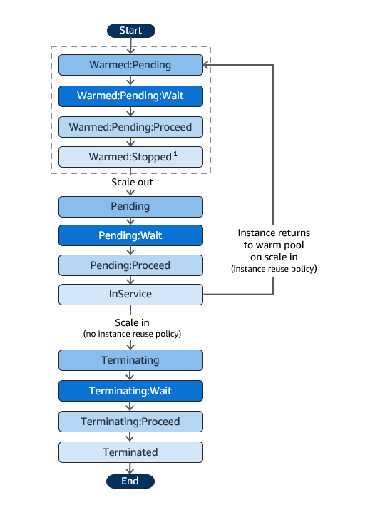

# Auto Scaling Groups

- The goal of an Auto Scaling Group (ASG) is to:
    - Scale out (add EC2 instances) to match an increasing load
    - Scale in (remove EC2 instances) to mach a decreasing load
    - Ensure we have a minimum and a maximum number of machines running
    - Automatically register new instances to LB
- ASG attributes:
    - A launch configuration:
        - AMI + Instance Type
        - EC2 User Data
        - EBS Volumes
        - Security Groups
        - SSH Key Pair
    - Min size/max size/initial capacity
    - Network + Subnet information
    - Load balancer information
    - Scaling Policies

## Launch Templates vs Launch Configurations

- Both allow to specify the AMI, the instance type, a key par, security groups and the other parameters that we use to launch EC2 instances (tags, user-data, etc.)
- Launch Configurations are considered to be legacy:
    - They must be recreated every time there are updated
- Launch Templates:
    - They can have multiple versions
    - They allow parameter subsets used for partial configuration for re-use and inheritance
    - We can provision both On-Demand and Spot instances (or a mix of two)
    - Optional: we can set an instance type, a key pair and a security group
    - We can use the T2 unlimited burst feature
    - Hierarchy: templates can have parents (source templates)
    - Recommended by AWS
- For ASG we can select between Launch Configurations and Launch Templates

## ASG - Scaling Policies

- **Scheduled scaling**:
    - Scaling based on a schedule allows us to scale the application ahead of know load changes
- **Dynamic scaling**:
    - **Target Tracking Scaling**:
        - Simple to set up
        - Example: we want the average ASG CPU to stay around 40%
    - **Simple/Step Scaling**
        - Requires the presence of a CloudWatch alarm
        - Example: 
            - When a CloudWatch alarm is triggered (example average CPU > 70%), then add 2 units
            - When a CloudWatch alarm is triggered (example average CPU < 30%), then remove 1 unit
- **Predictive scaling**:
    - ASG uses machine learning to schedule the right number of EC2 instances in anticipation of traffic changes

## Metrics to Scale On

- `CPUUtilization`: average CPU utilization across our instances
- `RequestCountPerTarget`: make sure the number of requests per EC2 instance is stable
- `AverageNetworkIn`/`AverageNetworkOut`
- Any custom metric we push into CloudWatch

## Cooldown and Warmup Period

- Default cooldown: number of seconds after a scaling activity completes before another can begin (cooldown period). Default value is 300 seconds
- During the cooldown period the ASG will not launch/terminate additional instances
- Warm up period: number of seconds ASG has to wait until the metric of a new instance can be taken in consideration for further ASG action

## ALB Integration

- Slow start duration: in target group we can set a duration period during which the number of requests will be gradually increased to the new instance

## ALB Troubleshooting - Suspend Processes

- Reference [https://docs.aws.amazon.com/autoscaling/ec2/userguide/as-suspend-resume-processes.html](https://docs.aws.amazon.com/autoscaling/ec2/userguide/as-suspend-resume-processes.html)
- Administrative suspension: most commonly applies to Auto Scaling groups that have been trying to launch instances for over 24 hours but have not succeeded in launching any instances
- Detach an instance:
    - The instance will be removed from the ASG
    - The ASG will replace the instance with a new one and will register it to the ELB
- Standby mode:
    - The instance will be removed from the ELB
    - The load will be increased on other instances, no new instance will be created
- Scale in protection: this can be set one a specific instance. If a scale in action happens, instances protected by scale in protection wont be terminated

## ASG Lifecycle Hooks

- Reference: [https://docs.aws.amazon.com/autoscaling/ec2/userguide/lifecycle-hooks.html](https://docs.aws.amazon.com/autoscaling/ec2/userguide/lifecycle-hooks.html)
- We can use lifecycle hooks to accomplish some work before our application goes live
- ASG states:



- We can perform actions before the goes in service at the `Pending` state of when the instance is in the `Terminating` state
- Use cases:
    - We can run a script to download and install software when a scale-out event occurs
    - When a scale-in event happens, we can send a notification to EventBridge to execute a Lambda in order to download logs from the instance
- Complete lifecycle action:
    ```
    aws autoscaling complete-lifecycle-action --lifecycle-action-result CONTINUE --lifecycle-hook-name LaunchHook --auto-scaling-group-name demo-asg --instance-id i-xxxx -region <region> --profile <profile>
    ```

## SNS Notifications

- ASG supports sending SNS notifications for the following kind of events:
    - `autoscaling:EC2_INSTANCE_LAUNCH`
    - `autoscaling:EC2_INSTANCE_LAUNCH_ERROR`
    - `autoscaling:EC2_INSTANCE_TERMINATE`
    - `autoscaling:EC2_INSTANCE_TERMINATE_ERROR`
- Integration with Event Bridge:
    - We can create rules that match the following ASG events:
        - EC2 instance launching, EC2 instance launch successful/unsuccessful
        - EC2 instance terminating, EC2 instance termination successful/unsuccessful
        - EC2 Auto Scaling Instance Refresh Checkpoint Reached
        - EC2 Auto Scaling Instance Refresh Started, Succeeded, Failed, Cancelled

## ASG Termination Policies

- Reference: [https://docs.aws.amazon.com/autoscaling/ec2/userguide/as-instance-termination.html](https://docs.aws.amazon.com/autoscaling/ec2/userguide/as-instance-termination.html)
- With termination policies we can control which instances are terminated first in case of a scale-in event
- Default termination policy: detects which AZ has the most instances with at least on instance which does not have termination protection. Within an AZ the default termination policy behavior is the following:
    1. Determine which instances to terminate first based on allocation strategy in case of mixed instance types (on-demand, spot)
    2. Determine whether any of the instances use the oldest launch template/launch configuration
    3. If there are multiple instances with the latest launch configuration, terminate the one with is the closes to the next billing hour. If there are multiple of this, terminate on at random
- Custom termination policies:
    - `Default`: (presented above)
    - `AllocationStrategy`: terminate instances to align the remaining ones to the allocation strategy
    - `OldestLaunchTemplate`: terminate instances which use an older launch configuration
    - `ClosestToNextInstanceHour`
    - `NewestInstance`
    - `OldestInstance`

## Warm Pools

- Scale-out latency problem:
    - When an ASG scales out, it tries to launch instances as fast as possible
    - Some applications contain a lengthy unavoidable latency that exists at the application initialization/bootstrap layer
    - Historically the solution was to over-provision compute resources to absorb the unexpected demand increases or to use Golden Images to try to reduce boot time
- Warm pools:
    - Used to reduce scale-out latency by maintaining a pool of pre-initialized instances
    - In case of a scale-out event, ASG uses the pre-initialized instances from the warm pool instead of launching new instances
- Warm pool size settings:
    - Warm pool size: calculated as the difference between the ASG groups' maximum desired capacity and its desired capacity
    - Minimum warm pool size: statically value set for the pool's minimum number of instances
- Warm pool instance state:
    - We can keep instances in the warm pool in one of these states: `Stopped`, `Running`, `Hibernated`
    - Any instance in the war pool does not contribute to the ASG metrics that affect Scaling Policies
- Instance reuse policy:
    - By default, ASG terminates instances in case of a scale-in, then it launches new instances in the warm pool
    - The instance reuse policy allows us to return instances to the warm pool when a scale-in happens
- Lifecycle hooks:



## ASG Integration with SQS

- Reference: [https://docs.aws.amazon.com/autoscaling/ec2/userguide/as-using-sqs-queue.html](https://docs.aws.amazon.com/autoscaling/ec2/userguide/as-using-sqs-queue.html)
- `ApproximateNumberOfMessagesVisible`: the number of messages in the queue
- We can create a custom metric which takes in consideration the number of messages in the queue, the number of currently running instances in the ASG and the processing time for a message from the queue. We can compute the number of instances required based on the accepted latency, example:

    ```
    ApproximateNumberOfMessages = 1500
    running capacity = 10
    processing time per message = 0.1 seconds
    acceptable latency = 10 seconds

    1500 / 10 = 150 * 0.1 = 15 - we need 15 instances to process the messages
    ```

- Scale In protection: we should protect our instances from scale in, in case there are processing a message, we would not want the instance to be terminated

## ASG ASG CloudFormation Creation Policy

- `CreationPolicy`: we can assign a creation policy in order to notify CloudFormation if the instances from an ASG were created successfully
- We can attach a timeout to the creation policy

## ASG CloudFormation Update Policy

- `UpdatePolicy` attribute: specified how CloudFormation handles updates:
    - `AutoScalingReplacingUpdate`: specify whether CloudFormation replaces an Auto Scaling group with a new one or replaces only the instances in the Auto Scaling group
        - `WillReplace`: specifies whether an Auto Scaling group and the instances it contains are replaced during an update. During replacement, CloudFormation retains the old group until it finishes creating the new one. If the update fails, CloudFormation can roll back to the old Auto Scaling group and delete the new Auto Scaling group
    - `AutoScalingRollingUpdate`: rolling updates enable us to specify whether AWS CloudFormation updates instances that are in an Auto Scaling group in batches or all at once
    - If both the `AutoScalingReplacingUpdate` and `AutoScalingRollingUpdate` policies are specified, setting the `WillReplace` property to `true` gives `AutoScalingReplacingUpdate` precedence
    - `AutoScalingScheduledAction`: prevent scheduled actions from modifying min/max/desired capacity for CloudFormation

## ASG CodeDeploy Integration

- CodeDeploy deployment to ASG: Whenever a new instance from an ASG is coming up, CodeDeploy will automatically deploy the application to it
- Scale-up events during deployment: if a scaling event happens during a deployment, the created instances will have the most recently deployed revision, not the currently deploying revision of the application
- Solution for this issue:
    - Redeploy the application
    - Suspend Launch process during deployment
- Reference: [https://docs.aws.amazon.com/codedeploy/latest/userguide/integrations-aws-auto-scaling.html](https://docs.aws.amazon.com/codedeploy/latest/userguide/integrations-aws-auto-scaling.html)

## ASG Deployment Strategies

- In place (one LB, one target group one ASG): instance state is mutate
- Rolling (one LB, one TG, one ASG, new instances): new instances are created with the newer version
- Replace (one LB, one TG, two ASG, new instances): new ASG is created with a new target group and new instances
- Blue/Green (tow LB, two TG, two ASG, new instances, R53)