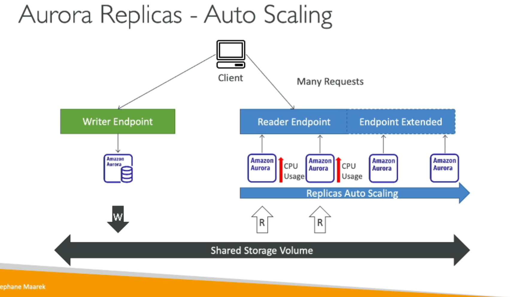

# RDS Read Replicas for Read Scalability

- Read replicas help us to scale our read operations
- We can create up to 15 read replicas within the same AZ, cross AZ or cross region
- Replication is **async** between the RDS and replicas => reads are eventually consistent
- Replicas can be promoted as standalone databases

## Read Replica Use Cases

- Read replicas are used for reading => only `SELECT` kind of statements should be executed on them
- Example of use case: analytics on top of the main database which can cause performance degradation of the main DB

## Read Replica Network Cost

- In AWS there is a network cost when data goes from one AZ to another
- Exception for managed services, since RDS read replicas are considered to be managed services, within the same region we don't pay a free for inter-AZ data transfer

## RDS Multi AZ (Disaster Recovery)

- It is a synchronous replication to another stand-by database in another AZ
- We have only one DNS name for the database, the failover in case of a disaster happens automatically => **will increaser availability**
- Failover happens automatically in case of an AZ outage, loss of networking connectivity or instance storage failure
- No manual intervention required
- **Not used for scaling!**
- The Read Replicas can also have Multi AZ synchronous replication enabled

## From Single-AZ to Multi-AZ

- In case we go for a database from single-AZ setup to multi-AZ:
    - There is no downtime (no need to stop the DB)
    - Only thing to do is to click on `modify` for the database
- The following will happen internally:
    - A snapshot is taken automatically
    - A new DB is restored automatically from the snapshot in a new AZ
    - Synchronization is established between the two databases

## Aurora Replicas - Auto Scaling

- Clients must use the writer endpoint for accessing the writer; they must connect to the reader endpoint to access the read replicas

## Global Aurora

- Aurora Cross Region Read Replicas:
    - Useful for disaster recovery
    - Simple to set up
- Aurora Global Database (recommended)
    - 1 region is defined as the primary region (can be used for reads and writes)
    - Up to 5 secondary regions, can be used for reads only. Replication lag is less than 1 second
    - We can have up to 16 read replicas per secondary region
    - In case of a disaster, the RTO for promoting another region is less than 1 minute
    - Typical cross-region replication takes less then 1 second