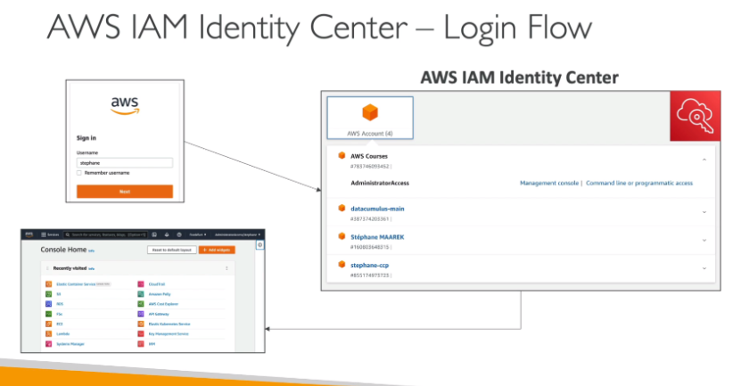
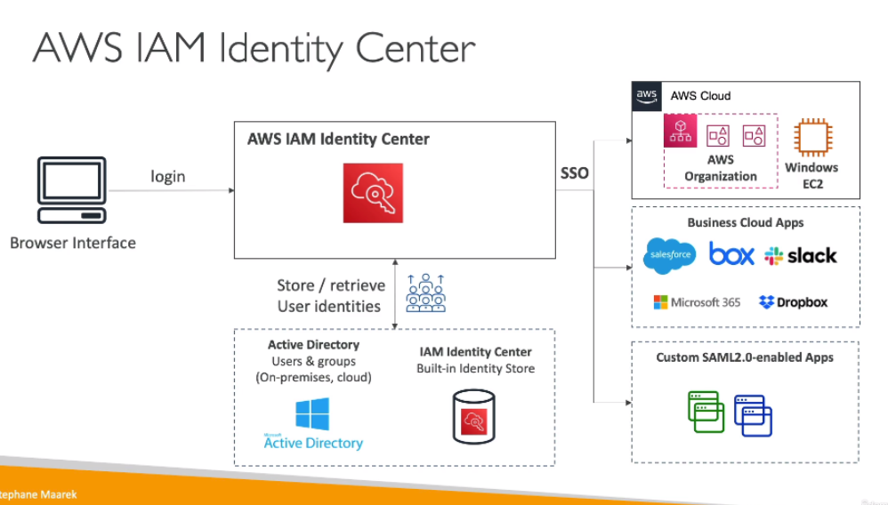

# AWS IAM Identity Center (successor to AWS Single Sign-On)

- One login (single sign-on) for all our:
    - AWS accounts in AWS Organizations
    - Business cloud applications (example Salesforce, Box, Microsoft 365, etc.)
    - Any application with SAML 2.0 integration
    - Login for EC2 Windows instances
- Identity provider can be:
    - Built-in identity store for IAM Identity Center
    - 3rd party: Active Directory (AD), OneLogin, Okta, etc.

## Login Flow

## Fine-grained Permissions and Assignments

- Multi-account permissions:
    - Manage access across AWS accounts in our AWS Organization
    - Permission Sets: collection of one or more IAM Policies assigned to users and groups to define AWS access
- Application Assignments:
    - SSO access to many SAML 2.0 business applications (Salesforce, Box, MS 365, etc.)
    - Provides required URLs, certificates and metadata
- Attribute-Based Access Control (ABAC):
    - They are fine-grained permissions based on users' attributes stored in IAM Identity Center Identity Store
    - Using these we can assign users to cost center, locale, etc.
    - Use cases: define permissions once, then modify AWS access by changing the attributes

## External IdPs

- We can integrate with external identity providers using SAML 2.0:
    - Users sign into AWS access portal using their corporate identities
    - Supports Okta, Azure AD, OneLogin, etc.
    - SAML 2.0 does NOT provide a way to query the IdP to learn about users and groups
    - We must create users and groups in the IAM Identity Center that are identical to the users and groups in the External IdP -> Solution to this is to use SCIM protocol
- SCIM (System for Cross-domain Identity Management): automatic provisioning (sync) of user identities from an external IdP into IAM Identity Center
    - Must be supported by external IdP
    - Perfect complement to using SAML 2.0

## Multi-Factor Authentication (MFA)

- Supports MFA with authentication modes:
    - Every Time They Sign-in (Always-on)
    - Only When Their Sign-in Context Changes (Context-aware): analyzes user behavior (example device browser, location)
