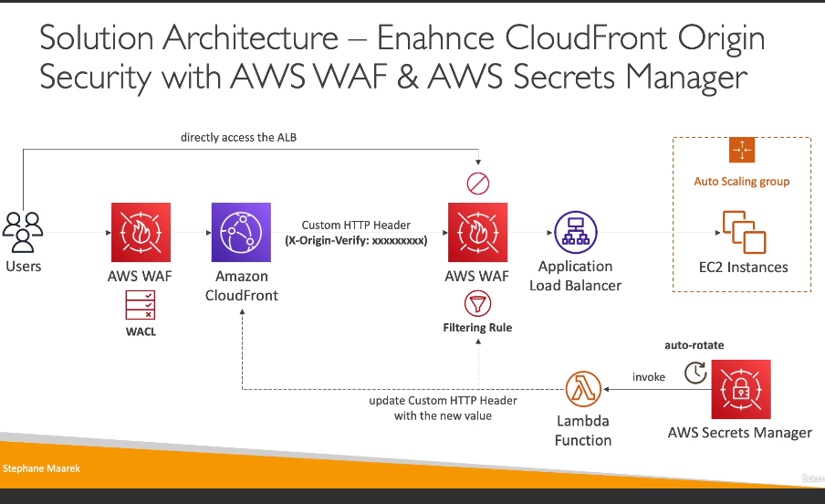

# AWS WAF - Web Application Firewall

- Protects our web applications from common web exploits (Layer 7)
- Can be deployed on:
    - Application Load Balancer (localized rules)
    - API Gateway (rules running at the regional or edge level)
    - CloudFront (rules running globally on edge locations)
        - Used to front other solutions: CLB, EC2 instances, custom origins, S3 websites
    - AppSync
- **WAF is not used for DDoS protection! Use Shield for that.**
- For WAF we have to define Web ACLs (Access Control Lists) - rules:
    - Rules can include IP address, HTTP headers, HTTP Body or URI strings
    - Rules that protect from common attacks: SQL injection and Cross-Site Scripting (XSS)
    - Rules based on size constraints, Geo match
    - Rate based rules
- Rule Actions: Count | Allow | Block | CAPTCHA

## Managed Rules

- WAF has a library of over 190 managed rules
- Ready-to-use rules are managed by AWS or we can get them from AWS Marketplace Sellers
- Rules:
    - Baseline Rule Groups - general protection from common threats: `AWSManagedRulesCommonRuleSet`, `AWSManagedRulesAdminProtectionRuleSet`
    - Use-case Specific Rule Groups - protection for many AWS WAF use cases: `AWSManagedRulesSQLiRuleSet`, `AWSManagedRulesWindowsRuleSet`, `AWSManagedRulesPHPRuleSet`, `AWSManagedRulesWordPressRuleSet`, etc.
    - IP Reputation Rule Groups - block request based on source: `AWSManagedRulesAmazonIpReputationList` (list of IP addresses trusted by AWS), `AWSManagedRulesAnonymousIpList`
    - Bot Control Managed Rule Group - block and manage requests from bots: `AWSManagedRulesBotControlRuleSet`

## Web ACL - Logging

- We can send logs to:
    - CloudWatch Log Groups: debit of 5 MB per second maximum
    - S3 bucket: logs are sent every 5 minutes
    - Kinesis Data Firehose: limited by Firehose quotas

## Enhance CloudFront Origin Security with AWS WAF and AWS Secrets Manager

- Use case: Only the traffic coming from CloudFront should be allow to the ALB

