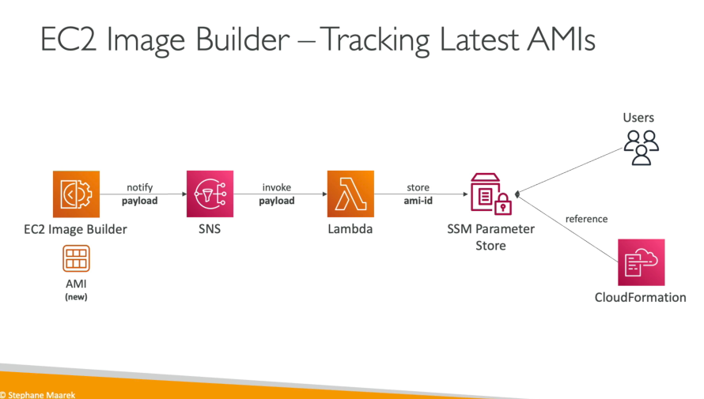

# EC2 Image Builder

- It is a service which can be used to automate the creation of virtual machines or container images
- We can automate the creation, maintain, validate and test EC2 AMIs
- Can be run on a schedule or we can use other automation to execute it
- It is a free service (we pay for the underlying resources)
- We can publish AMIs to multiple regions and multiple accounts

## Sharing using RAM

- We can use AWS RAM (Resource Access Manager) to share Images, Recipes and Components across AWS accounts or through AWS Organization

## Tracking the Latest AMIs

