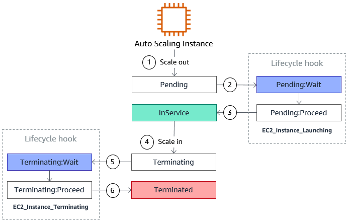

# Auto Scaling Groups

- The goal of an Auto Scaling Group (ASG) is to:
    - Scale out (add EC2 instances) to match an increasing load
    - Scale in (remove EC2 instances) to mach a decreasing load
    - Ensure we have a minimum and a maximum number of machines running
    - Automatically register new instances to LB
- ASG attributes:
    - A launch configuration:
        - AMI + Instance Type
        - EC2 User Data
        - EBS Volumes
        - Security Groups
        - SSH Key Pair
    - Min size/max size/initial capacity
    - Network + Subnet information
    - Load balancer information
    - Scaling Policies

## Launch Templates vs Launch Configurations

- Both allow to specify the AMI, the instance type, a key par, security groups and the other parameters that we use to launch EC2 instances (tags, user-data, etc.)
- Launch Configurations are considered to be legacy:
    - They must be recreated every time there are updated
- Launch Templates:
    - They can have multiple versions
    - They allow parameter subsets used for partial configuration for re-use and inheritance
    - We can provision both On-Demand and Spot instances (or a mix of two)
    - Optional: we can set an instance type, a key pair and a security group
    - We can use the T2 unlimited burst feature
    - Hierarchy: templates can have parents (source templates)
    - Recommended by AWS
- For ASG we can select between Launch Configurations and Launch Templates

## ASG - Types of Scaling

- Scheduled scaling:
    - Scaling based on a schedule allows us to scale the application ahead of know load changes
- Dynamic scaling:
    - ASG enables us to follow the demand curve for our application closely, reducing the need to manually provision instances
    - ASG can automatically adjust the number of EC2 instances as needed to maintain a target
- Predictive scaling:
    - ASG uses machine learning to schedule the right number of EC2 instances in anticipation of traffic changes

## Scheduled Actions

- Can be used if we can anticipate scaling based on known usage patterns
- Example: increase the min capacity to 10 at 5 PM on Fridays
- Occurrence can be once, every 5, 30, 60 minutes or a cron expression

## Scaling Policies

- Default cooldown: number of seconds after a scaling activity completes before another can begin (cooldown period). Default value is 300 seconds
- Warm up period: number of seconds ASG has to wait until the metric of a new instance can be taken in consideration for further ASG action
- **Target Tracking Scaling**
    - Most simple and easy to setup
    - Example: we want the average ASG CPU to stay around 40%
- **Simple/Step Scaling**
    - Requires the presence of a CloudWatch alarm
    - Example: 
        - When a CloudWatch alarm is triggered (example average CPU > 70%), then add 2 units
        - When a CloudWatch alarm is triggered (example average CPU < 30%), then remove 1 unit
- **Scheduled Actions**
    - Can be used if we can anticipate scaling based on known usage patterns
    - Example: increase the min capacity to 10 at 5 PM on Fridays

## ALB Integration

Slow start duration: in target group we can set a duration period during which the number of requests will be gradually increased to the new instance

## ALB Troubleshooting - Suspend Processes

- Reference [https://docs.aws.amazon.com/autoscaling/ec2/userguide/as-suspend-resume-processes.html](https://docs.aws.amazon.com/autoscaling/ec2/userguide/as-suspend-resume-processes.html)
- Administrative suspension: most commonly applies to Auto Scaling groups that have been trying to launch instances for over 24 hours but have not succeeded in launching any instances
- Detach an instance:
    - The instance will be removed from the ASG
    - The ASG will replace the instance with a new one and will register it to the ELB
- Standby mode:
    - The instance will be removed from the ELB
    - The load will be increased on other instances, no new instance will be created
- Scale in protection: this can be set one a specific instance. If a scale in action happens, instances protected by scale in protection wont be terminated

## ASG Lifecycle Hooks

- Reference: [https://docs.aws.amazon.com/autoscaling/ec2/userguide/lifecycle-hooks.html](https://docs.aws.amazon.com/autoscaling/ec2/userguide/lifecycle-hooks.html)
- We can add lifecycle hooks to an ASG
- These hooks enable ASG to be aware of events during scaling and perform custom actions when events happens
- Use cases:
    - We can run a script to download and install software when a scale-out event occurs
    - When a scale-in event happens, we can send a notification to EventBridge to execute a Lambda in order to download logs from the instance
- Transitions between ASG states:
    
- Complete lifecycle action:
    ```
    aws autoscaling complete-lifecycle-action --lifecycle-action-result CONTINUE --lifecycle-hook-name LaunchHook --auto-scaling-group-name demo-asg --instance-id i-xxxx -region <region> --profile <profile>
    ```